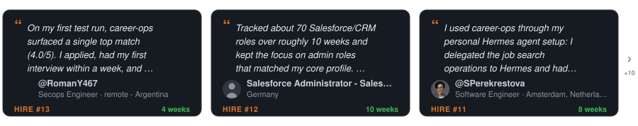
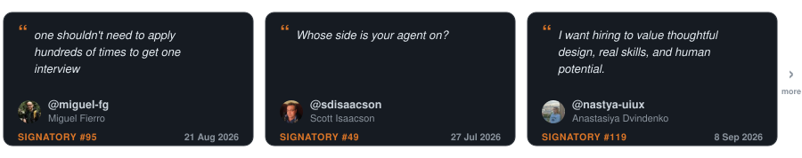

<p align="center"><picture><source media="(prefers-color-scheme: dark)" srcset="docs/wordmark-dark.svg"></picture></p>

<p align="center">Open source-AI-agenten til jobsøgning.</p>

<p align="center">
  <a href="README.md">English</a> |
  <a href="README.es.md">Español</a> |
  <a href="README.de.md">Deutsch</a> |
  <a href="README.fr.md">Français</a> |
  <a href="README.pt-BR.md">Português (Brasil)</a> |
  <a href="README.ko-KR.md">한국어</a> |
  <a href="README.ja.md">日本語</a> |
  <a href="README.cn.md">简体中文</a> |
  <a href="README.zh-TW.md">繁體中文</a> |
  <a href="README.ua.md">Українська</a> |
  <a href="README.ru.md">Русский</a> |
  <a href="README.pl.md">Polski</a> |
  <a href="README.da.md">Dansk</a> |
  <a href="README.ta.md">தமிழ்</a> |
  <a href="README.ar.md">العربية</a> |
  <a href="README.hi.md">हिन्दी</a> |
  <a href="README.tr.md">Türkçe</a>
</p>

<!-- The non-breaking spaces (&nbsp;) and word joiners (&#8288;) below decide where each line wraps on a phone. Keep them when editing. -->

<p align="center"><a href="https://github.com/santifer"></a>&nbsp;&nbsp;<a href="https://github.com/santifer"><strong>santifer</strong></a></p>

<p align="center">
<strong>Måneder med at sende CV'er ud i&nbsp;stilheden.</strong><br>
Så jeg byggede det filter, jeg havde brug&nbsp;for.
</p>

<p align="center">
<strong>740&nbsp;opslag&nbsp;vurderet. 68&nbsp;ansøgt. 12&nbsp;samtaler.&nbsp;1&nbsp;tilbud.</strong><br>
Jeg var den første bruger. Jeg fik&nbsp;jobbet. Så&nbsp;gjorde&nbsp;jeg&nbsp;det&nbsp;open&nbsp;source.
</p>

<p align="center">
Indsæt et job. På din egen maskine fortæller den dig, om det stadig er&nbsp;åbent og om det passer til&nbsp;dig.<br>
Den tilpasser dit CV og skriver udkast til dine&nbsp;svar. <strong>Du&nbsp;trykker&nbsp;på&nbsp;Send.</strong>
</p>

<p align="center">
  
</p>

<p align="center"><sub>Min egen jobsøgning, undervejs, med&nbsp;brugerfladen&nbsp;på&nbsp;spansk.</sub></p>

<p align="center">
  Virksomheder bruger AI til at filtrere kandidater.<br>
  <strong>Jeg gav kandidaterne AI, så&nbsp;de&nbsp;kan&nbsp;<em>vælge</em>&nbsp;virksomhederne.</strong>
</p>

<p align="center">
  Seks måneder senere <strong>forlod jeg det job.</strong><br>
  Nu bygger vi career-ops, så&nbsp;du&nbsp;kan&nbsp;lande&nbsp;dit.
</p>

<p align="center"><a href="#din-tur">Prøv den på ét&nbsp;job&nbsp;↓</a> · <a href="https://santifer.io/career-ops-system">Læs hele&nbsp;historien&nbsp;→</a></p>

<br>

<p align="center"><a href="HIRED.md"></a></p>

<p align="center">De, der kom efter mig, skrev ned, hvordan de blev ansat.</p>

<p align="center">
  <a href="HIRED.md"></a>
</p>

<p align="center"><sub>Hvert kort er et offentligt issue, du kan åbne. Har du fået dit job? <a href="https://github.com/career-ops-hq/career-ops/issues/new?template=i-got-hired.yml">Efterlad dit kort →</a></sub></p>

<p align="center">⭐ <strong>Hvis career-ops har hjulpet dig, hjælper en stjerne den næste med at finde&nbsp;det.</strong></p>

<br>

<p align="center">
  <a href="https://wired.com.gr/article/to-ai-ergaleio-pou-fernei-epanastasi-ston-tropo-pou-psachnoume-douleia/" rel="noopener noreferrer nofollow"><picture><source media="(prefers-color-scheme: dark)" srcset="docs/press/wired-dark.svg"></picture></a>
  &nbsp;&nbsp;&nbsp;&nbsp;
  <a href="https://www.businessinsider.com/how-i-built-tool-filter-job-listings-landed-head-ai-2026-4" rel="noopener noreferrer nofollow"><picture><source media="(prefers-color-scheme: dark)" srcset="docs/press/business-insider-dark.svg"></picture></a>
</p>

<p align="center">
  <a href="https://vercel.com/open-source-program"></a>
</p>

<p align="center">
  <a href="https://trendshift.io/repositories/25195" rel="noopener noreferrer"></a>
  &nbsp;&nbsp;&nbsp;&nbsp;
  <a href="https://www.producthunt.com/products/santifer-io?utm_source=badge-featured&utm_medium=badge" rel="noopener noreferrer"></a>
</p>

## Din tur

Indsæt ét job, du var ved at søge i aften. Kommer det tilbage som <em>søg ikke</em>, har du lige fået aftenen tilbage. Kommer det tilbage med en plan, ved du, hvad du skal gøre nu.

```bash
npx @santifer/career-ops init
```

<p align="center"><sub>Open source. Lokalt. I den AI-CLI, du allerede bruger. <a href="docs/RUNNING_ON_A_BUDGET.md">Gratis og lokale modeller inkluderet.</a></sub></p>


## Du behøver ikke søge alene

Stilheden, efter du trykker send, handler ikke om dig. Nok mennesker så det samme til at skrive praksissen ned, i seks linjer:

> Søg bedre, til færre. Signal frem for volumen. Beviser frem for nøgleord. Et menneske beslutter. Lokalt først. Værdighed på begge sider af bordet.

<p align="center"><a href="https://career-ops.org/manifesto?utm_source=readme"></a></p>

<p align="center">Et par af dem, med deres egne ord.</p>

<p align="center">
  <a href="https://career-ops.org/manifesto?utm_source=readme"></a>
</p>

<p align="center"><sub>Hver underskrift er et commit, du kan efterprøve. <a href="https://career-ops.org/manifesto?utm_source=readme">Læs dem alle, eller tilføj din →</a></sub></p>

<br>

Rekruttering reparerer ikke sig selv. Det kan de, der går igennem den, og de er allerede i rummet, hvor de sammenligner noter og fikser hinandens opsætninger. [Det er her, rettelsen bliver skrevet](CONTRIBUTING.md). Et rum, ikke en klub. **Lad os bygge sammen.**

<p align="center"><a href="https://discord.gg/8pRpHETxa4"></a></p>

## Sponsorer

career-ops er gratis for kandidater, for altid. Disse virksomheder sponsorerer projektet:

<p align="center">
  <a href="https://serpapi.com/career-ops-org" title="SerpApi"></a>
</p>

<p align="center"><strong>SerpApi</strong> · Build a portfolio project with live search data. SerpApi gives developers structured JSON/Markdown from Google Search, Maps, Shopping, and other engines through a simple API call.</p>

> Sponsorat køber tydeligt markeret synlighed, aldrig indflydelse: intet beløb ændrer køreplanen eller placerer noget i produktet. Sponsorer optræder aldrig i evalueringer, rangeringer eller anbefalinger.

## Hvad career-ops gør for dig

Indsæt et job. Den fortæller dig, om aftenen er det værd.

- **Stadig åbent?** Den tjekker, at opslaget stadig er aktivt, før du skriver et ord.
- **Ikke dig?** Den scorer rollen op mod dit rigtige CV og siger, at du skal springe et svagt match over. Du kan tilsidesætte den.
- **Værd at søge?** Den skriver udkast til CV, ansøgning og svar. Du læser dem. Du sender dem.
- **Hvem skal jeg tale med?** Den finder personen og skriver udkast til beskeden. Den sender den aldrig.
- **Hvor ender det hele?** Hver ansøgning bliver på din maskine. Intet bliver uploadet til os.
- **Hvad bør jeg lære?** Efter en stribe afslag sætter den navn på hullet.

De første kørsler er ujævne. Den kender dig ikke endnu. Tal med den: dit CV, hvad du vil, hvad du afviser. Tænk på det som en rekrutterers første uge.

Ved første start spørger den om alt det i chatten. Intet at konfigurere i hånden.

## Hvad career-ops ikke gør

- **Sende en ansøgning automatisk.** Den skriver udkast til svaret i hvert felt; du gennemgår og klikker Send. Scriptet laver aldrig et POST (`prepare-application.mjs`).
- **Sender en e-mail.** Kun udkast. Der findes ingen mailtransport nogen steder i koden.
- **Ringer hjem.** Ingen telemetri, ingen backend hos os. Dit CV går fra din maskine til den AI-udbyder, du har valgt, og ingen andre steder. Det eneste offentlige register er dette repository: `HIRED.md` og dets issues.
- **Presser dig til at søge under 4,0/5.** Den siger, du skal lade være. Du kan tilsidesætte det, og den siger det.

Den omformulerer dit CV; den må aldrig opdigte det. En kontrol i koden stopper en PDF med tal eller fakta, der hverken står i dit CV eller i `article-digest.md`, men den kan endnu ikke vurdere enhver omformulering. Læs hvert CV, før du sender det. Detaljer i [FAQ](#faq).

## Funktioner

| Funktion                 | Beskrivelse                                                                                                                              |
| ------------------------ | ---------------------------------------------------------------------------------------------------------------------------------------- |
| **A-H-vurdering**        | Rolleresumé, CV-match (med hvor meget hvert krav betyder for dette opslag, og om vægten kom fra jobbeskrivelsens egen ordlyd, dens struktur eller et skøn, mærket pr. krav; et skøn kan aldrig ligge i topbåndet), niveaustrategi, lønresearch, personalisering, samtaleforberedelse (STAR+R), plus et troværdighedstjek i blok G (er det stadig åbent, er det et genopslag: observationer, ikke domme), og et arbejdstilladelsessignal, der markerer en jobbeskrivelse med eksplicit ingen visumsponsorering som en hård blokering |
| **Human-in-the-Loop**    | AI vurderer og anbefaler, du beslutter og handler. Systemet indsender aldrig en ansøgning: du har altid det sidste ord <!-- hitl: absolute guarantee. Do not add "automatically", "by itself", "without your permission" or any other hedge when translating this row. -->               |
| **ATS-PDF-generering**   | ATS-læsbare CV'er tilpasset hver jobbeskrivelse ud fra din egen erfaring, i Space Grotesk + DM Sans-design                                |
| **Ansøgningsgenerator**  | Researchbaserede ansøgninger med spejling af nøgleord, fire interaktive vinkelspørgsmål (hvorfor/problemer/tilgang/tone), godkendelse af udkast i chatten og A4-PDF via samme HTML + Playwright-pipeline som CV'er. Laver automatisk udkast ved hver vurdering; færdiggør og generér efter behov via `/career-ops cover` |
| **Ud over CV'et**        | Virksomhedsresearch ([`deep`](modes/deep.md)) afdækker AI-strategi, seneste træk, engineering-kultur og den vinkel, din profil bør tage. Kontaktsøgning ([`contacto`](modes/contacto.md)) finder den hiring manager, rekrutterer eller kollega, det er værd at kontakte, og skriver et LinkedIn-udkast på ≤300 tegn tilpasset hver kontakttype. Formelle udkast til ansøgningsmails ([`email`](modes/email.md)) gør en vurderet rapport eller indsat jobbeskrivelse til emnelinje, brødtekst og tjekliste over vedhæftninger uden at sende, indsende eller klikke på noget. Ansøgninger sætter dig i køen; research giver dig en samtale. |
| **Mønsteranalyse**       | Afslagsmønstre og fremgangsrater pr. ATS-kanal (`analyze-patterns.mjs`), tragtstatistik for hele søgningen (`stats.mjs`), registrering af genopslag, et muligt tegn på et spøgelsesjob (`detect-reposts.mjs`) |

<details>
<summary><b>Alt det andet, den gør</b></summary>

| Funktion                 | Beskrivelse                                                                                                                              |
| ------------------------ | ---------------------------------------------------------------------------------------------------------------------------------------- |
| **Auto-pipeline**        | Indsæt en URL, få en fuld vurdering + PDF + tracker-post                                                                                 |
| **Interview-historiebank** | Samler STAR+Reflection-historier på tværs af vurderinger: 5-10 masterhistorier, du kan tilpasse til de adfærdsspørgsmål, du får          |
| **Forhandlingsscripts**  | Rammer for lønforhandling, modsvar til geografisk rabat, brug af konkurrerende tilbud                                                    |
| **Udkast til ansøgningsmails** | Formelle mails til rekrutterer, henvisning eller uopfordret ansøgning fra en rapport eller indsat jobbeskrivelse, med emnelinje, tjekliste over vedhæftninger, dokumenterede matchpunkter og en kontaktblok fra din profil. Kun udkast: career-ops sender, indsender eller klikker aldrig på noget. |
| **Portalscanner**        | 100+ forudkonfigurerede virksomheder (Anthropic, OpenAI, ElevenLabs, Retool, n8n...) + egne søgninger på tværs af Ashby, Greenhouse, Lever, Wellfound |
| **Find finansierede virksomheder** | Kommandoen `company:funded` (gennemse først) viser nyligt finansierede virksomheder og kildediagnostik fra strukturerede offentlige feeds uden at redigere dine data |
| **Batch-behandling**     | Parallel vurdering med headless CLI-workers (`claude -p` / `opencode run`)                                                               |
| **Dashboard TUI**        | Terminal-UI til at gennemse, filtrere og sortere din pipeline                                                                            |
| **Pipeline-integritet**  | Automatisk sammenfletning, deduplikering, statusnormalisering, sundhedstjek                                                              |
| **Interview-pakke**      | Tidsblokkede forberedelsesplaner, øvesessioner med feedback, debriefs efter samtalen ([`interview/`](modes/interview/README.md)) og en detektor for røde flag hos virksomheden ([`interview-redflag`](modes/interview-redflag.md)) |
| **Tilbudsfasen**         | Følgesvend til kontraktlæsning: gennemgang klausul for klausul plus en spørgsmålsliste til advokaten ([`offer-prep`](modes/offer-prep.md)), og en analyse af gabet mellem ønsket, annonceret og faktisk løn (`salary-gap.mjs`) |
| **Opfølgning og svar**   | Beregner af opfølgningskadence og forberedte påmindelser (`followup-cadence.mjs`, `followup-seed.mjs`); klassificering af arbejdsgiverens svar til tracker-opdateringer ([`reply-watch`](modes/reply-watch.md)) |
| **Plugin-system**        | Tilvalgsintegrationer (Gmail, Notion, Apify + et community-register), slået fra som standard; se [docs/PLUGINS.md](docs/PLUGINS.md)      |

</details>

## Hurtig start

**Hurtigste vej, én kommando:**

```bash
npx @santifer/career-ops init
```

> 💡 `npx` følger med [Node.js](https://nodejs.org): det kører installationen én gang
> uden at installere noget globalt. Ingen Node endnu? Installer den først.
> (Bruger du allerede en Claude Code / Gemini / Codex CLI? Så har du den allerede.)

Det kloner den seneste udgivelse ind i `./career-ops` og installerer afhængigheder. Derefter:

```bash
cd career-ops
claude   # or codex / qwen / opencode / agy / grok — open your AI CLI here
```

**Ved første start fører career-ops dig gennem opsætningen (dit CV, din profil og dine målroller) bare ved at chatte. Intet at redigere i hånden.**

<details>
<summary><b>Foretrækker du at sætte det op manuelt? (git clone)</b></summary>

```bash
git clone https://github.com/career-ops-hq/career-ops.git
cd career-ops && npm install
npx playwright install chromium   # only needed for PDF generation
# On a non-Debian/Ubuntu Linux distro (Fedora, Arch, ...), Chromium's system
# libraries aren't installed by the line above — install them yourself with
# your distro's package manager if PDF generation fails to launch the browser
# (Playwright's own docs list the required libraries per platform).

# 2. Check setup
npm run doctor                     # Validates all prerequisites

# 3. Configure
cp config/profile.example.yml config/profile.yml  # Edit with your details
cp templates/portals.example.yml portals.yml       # Customize companies

# 4. Add your CV
# Create cv.md in the project root with your CV in markdown

# 5. Open your AI CLI in this directory
claude   # or codex / opencode / qwen / agy / grok

# Then ask your CLI to adapt the system to you:
# "Change the archetypes to backend engineering roles"
# "Translate the modes to English"
# "Add these 5 companies to portals.yml"
# "Update my profile with this CV I'm pasting"

# 6. Start using
# Paste a job URL or JD text to trigger auto-pipeline
# If your CLI supports slash commands, use /career-ops (or its CLI-specific alias)
# In Codex, ask for the same mode in plain language, e.g.:
# "Run the career-ops scan mode"
# "Run the career-ops pipeline mode for data/pipeline.md"
# "Run the career-ops pdf mode for the latest evaluated role"
# "Run the career-ops tracker mode and summarize the current statuses"
```

</details>

### Global installation

```bash
npm i -g @santifer/career-ops
```

Det installerer `career-ops`-binæren globalt, så du kan køre den direkte i stedet for via `npx`. I modsætning til `npx @santifer/career-ops init` (som opretter en projektmappe) giver den globale installation dig en permanent `career-ops`-kommando, der er tilgængelig overalt i din terminal.

**Hvilken skal du bruge?**
- `npx @santifer/career-ops init`: bedst til første brug; opretter en dedikeret projektmappe.
- `npm i -g @santifer/career-ops`: bedst, når du har en projektmappe og vil køre career-ops-kommandoer direkte.

> **Systemet er designet til at blive tilpasset af din AI-kodnings-CLI selv.** Tilstande, arketyper, scorevægte, forhandlingsscripts: bed den bare om at ændre dem. Den læser de samme filer, som den bruger, så den ved præcis, hvad den skal redigere.

Se [docs/SETUP.md](docs/SETUP.md) for den fulde opsætningsguide, [docs/RUNNING_ON_A_BUDGET.md](docs/RUNNING_ON_A_BUDGET.md) for at køre career-ops billigt med egne eller lokale modeller (og [docs/FREE_TIER.md](docs/FREE_TIER.md) for at køre det gratis på Antigravity CLI's gratis niveau), [docs/AUTOMATION.md](docs/AUTOMATION.md) for planlægning af tilbagevendende scanninger og en opskrift på triage-til-shortlist uden tokens, [docs/APPLY_AUTOFILL.md](docs/APPLY_AUTOFILL.md) for detaljer om ATS-autoudfyldningsflowet, [docs/LINKEDIN_JOIN.md](docs/LINKEDIN_JOIN.md) for at krydstjekke en eksport af dine LinkedIn-forbindelser mod virksomhederne i din tragt, og [docs/FAQ.md](docs/FAQ.md) for svar på almindelige opsætningsspørgsmål, herunder [hvordan historiers oprindelse forhindrer opdigtede tal](docs/FAQ.md#why-does-career-ops-refuse-to-use-a-number-from-my-story-bank). Designprincipper ligger i [ARCHITECTURE.md](ARCHITECTURE.md); runtime-flows i [docs/ARCHITECTURE.md](docs/ARCHITECTURE.md).

## Brug

career-ops bruger en fælles kommandorouter. I CLI'er, der registrerer slash-kommandoer, ser det sådan ud:

```
/career-ops           → Vis alle tilgængelige kommandoer
/career-ops {JD}      → AUTO-PIPELINE: vurdering + rapport + PDF + tracker (indsæt tekst eller URL)
/career-ops pipeline  → Behandl ventende URL'er fra indbakken (data/pipeline.md)
/career-ops oferta    → Kun vurdering, blok A til H (ingen automatisk PDF)
/career-ops ofertas   → Sammenlign og rangér flere opslag
/career-ops contacto  → LinkedIn-trækket: find kontakter + skriv udkast til besked
/career-ops deep      → Prompt til dyb research af virksomheden
/career-ops interview-prep → Generér et virksomhedsspecifikt forberedelsesdokument til samtalen
/career-ops interview    → Interaktivt onboarding-interview om profil og CV
/career-ops master-profile → Importér, gennemgå og validér din Master Career Profile
/career-ops eu-swe    → Kalibrér en europæisk SWE-ansøgning før CV, ansøgning eller samtale
/career-ops interview/plan → Tidsblokket forberedelsesplan til en kommende samtale
/career-ops interview/practice → Øvesamtale, ét spørgsmål ad gangen med feedback
/career-ops interview/debrief → Debrief efter samtalen: luk huller, forudsig næste runde
/career-ops interview-redflag → Analysér arbejdsgiverens advarselstegn, før du starter
/career-ops pdf       → Kun PDF, ATS-optimeret CV
/career-ops text      → Tilpasset markdown-CV (spejler cv.md, ingen PDF)
/career-ops latex     → Eksportér CV som LaTeX/Overleaf .tex
/career-ops latex-tex → Tilpas din egen resume.tex på stedet (tilvalg; cv.md forbliver standard)
/career-ops cover     → Ansøgning: selvstændig indsat jobbeskrivelse eller /career-ops cover {slug}
/career-ops email     → Udkast til formel ansøgningsmail (kun udkast; sender, indsender eller klikker aldrig)
/career-ops add       → Tilføj et projekt/en artikel/en rolle til dit CV (hent + forhåndsvis + bekræft)
/career-ops expand    → Find og tilføj manglende kompetencer automatisk fra profil-links
/career-ops training  → Vurdér kursus/certificering mod dit North Star
/career-ops project   → Vurdér en idé til et porteføljeprojekt
/career-ops tracker   → Overblik over ansøgningsstatus
/career-ops agent-inbox → Kø/tøm anmodninger til næste session (data/agent-inbox.md)
/career-ops apply     → Live ansøgningsassistent (læser formularen + genererer svar)
/career-ops scan      → Scan portaler og find nye opslag
/career-ops discover  → Omsæt en virksomhedsliste til scanbare ATS-boards + tilføj til portals.yml (uden tokens)
/career-ops batch     → Batch-behandling med parallelle workers
/career-ops patterns  → Analysér afslagsmønstre og forbedr målretningen
/career-ops offer-prep → Læs et modtaget tilbud/en kontrakt sammen med kandidaten: gennemgang af klausuler + spørgsmål til advokaten (ikke juridisk rådgivning)
/career-ops titles    → Foreslå beslægtede jobtitler ud fra dit CV for at udvide søgningen
/career-ops upskill   → Samlet analyse af kompetencegab ud fra dine vurderede rapporter
/career-ops followup  → Tracker for opfølgningskadence: markér forfaldne, generér udkast
/career-ops reply-watch → Klassificér arbejdsgiverens svar og foreslå tracker-opdateringer
/career-ops outcome   → Registrér ansøgningens udfald og arkivér artefakter
/career-ops calibrate → Rådgivende rapport: forudsiger dine vurderingsscorer dine reelle udfald? Læser /outcome-data; ændrer aldrig scoringen
/career-ops update    → Opdatér career-ops' systemfiler med diff-forhåndsvisning + kompatibilitetstjek
```

Eller indsæt bare en job-URL eller beskrivelse direkte: career-ops registrerer den automatisk og kører den fulde pipeline.

I Codex er slash-kommandoer ikke garanteret. Brug i stedet de samme tilstandsnavne i en prompt, eller kald dem fra `codex exec`.

## Sådan virker det

```
You paste a job URL or description
        │
        ▼
┌──────────────────┐
│  Archetype       │  Classifies: LLMOps / Agentic / PM / SA / FDE / Transformation
│  Detection       │
└────────┬─────────┘
         │
┌────────▼─────────┐
│  A-H Evaluation  │  Match, gaps, comp research, STAR stories, legitimacy
│  (reads cv.md)   │
└────────┬─────────┘
         │
    ┌────┼────┐
    ▼    ▼    ▼
 Report  PDF  Tracker
  .md   .pdf  entry
```

## Antigravity CLI-integration

career-ops understøtter Antigravity CLI indbygget, på samme måde som Claude Code og OpenCode. Alle slash-kommandoer er tilgængelige gennem det fælles skill-indgangspunkt med samme `modes/*.md`-vurderingslogik.

Google har flyttet forbrugeradgangen til Gemini CLI over på Antigravity CLI. `GEMINI.md` er nu en virkningsløs kompatibilitetsvagt, så Antigravity ikke dublerer de fulde projektinstruktioner, når den læser både `AGENTS.md` og `GEMINI.md`.

### Indbygget Antigravity CLI

```bash
# 1. Run in the career-ops directory
cd career-ops
agy

# 2. Use the unified /career-ops command with subcommands:
/career-ops "Senior AI Engineer at Anthropic..."
/career-ops pipeline
/career-ops scan
/career-ops pdf
/career-ops tracker
```

Skillet er defineret efter den åbne standard i `.agents/skills/career-ops/SKILL.md` og symlinket/refereret for hver understøttet CLI (fx `.claude/`, `.cursor/`, `.qwen/`, `.antigravitycli/`, `.grok/`).

## Codex-integration

career-ops understøtter Codex gennem den samme fælles router, men kaldemodellen er anderledes end for CLI'er, der automatisk registrerer slash-kommandoer. Den fulde guide findes i [docs/CODEX.md](docs/CODEX.md).

### Interaktiv Codex

```bash
cd career-ops
codex
```

Slash-kommandoer er ikke garanteret i Codex. Hvis `/career-ops` ikke er tilgængelig, så bed Codex om at køre tilstanden direkte på almindeligt sprog:

```text
Evaluate this JD with career-ops auto-pipeline: https://company.com/jobs/123
Run the career-ops scan mode and summarize new matches.
Run the career-ops pipeline mode for data/pipeline.md.
Run the career-ops pdf mode for the latest evaluated role.
Run the career-ops tracker mode and summarize the current statuses.
```

### Codex i ét kald (`codex exec`)

```bash
codex exec "Evaluate this JD with career-ops auto-pipeline: https://company.com/jobs/123"
codex exec "Run career-ops scan mode in this repo and summarize new matches."
codex exec "Run career-ops pipeline mode for data/pipeline.md."
codex exec "Run career-ops pdf mode for the latest evaluated role."
codex exec "Run career-ops tracker mode and summarize the current statuses."
```

## Grok Build CLI-integration

career-ops understøtter Grok Build CLI indbygget, på samme måde som Claude Code og OpenCode. `AGENTS.md` indlæses automatisk som projektregler, og alle slash-kommandoer er tilgængelige gennem det fælles skill-indgangspunkt.

### Indbygget Grok Build CLI

```bash
# 1. Run in the career-ops directory
cd career-ops
grok

# 2. Use the unified /career-ops command with subcommands:
/career-ops "Senior AI Engineer at Anthropic..."
/career-ops pipeline
/career-ops scan
/career-ops pdf
/career-ops tracker
```

Til headless batch-workers, brug `grok -p "prompt"` (tilføj `--yolo` for automatisk at godkende værktøjskørsler).

## Pi-integration

career-ops understøtter [Pi](https://github.com/earendil-works/pi) indbygget, uden nogen wrapper-fil at vedligeholde: Pi læser `AGENTS.md` fra repository-roden som projektkontekst og finder selv det fælles skill i `.agents/skills/career-ops/SKILL.md`. Routeren er derefter tilgængelig som `/skill:career-ops`.

### Indbygget Pi

```bash
# 1. Run in the career-ops directory
cd career-ops
pi

# 2. Use the shared skill with subcommands:
/skill:career-ops "Senior AI Engineer at Anthropic..."
/skill:career-ops pipeline
/skill:career-ops scan
/skill:career-ops pdf
/skill:career-ops tracker
```

### Pi i ét kald (`pi -p`)

```bash
pi -p "Evaluate this JD with career-ops auto-pipeline: https://company.com/jobs/123"
pi -p "Run career-ops scan mode and summarize new matches."
pi -p "Run career-ops tracker mode and summarize the current statuses."
```

Hvis et Pi-build lægger projektets ressourcer bag en tillidsbeslutning, så kør `/trust` én gang inde i repositoryet og genstart `pi`, så projektets skill indlæses (`/trust` gælder for fremtidige Pi-processer), eller start med `-a`, som giver tillid til en enkelt kørsel og ikke kræver genstart.

### Selvstændigt Gemini API-script (ingen CLI-installation nødvendig)

```bash
# 1. Get a free API key at https://aistudio.google.com/apikey
cp .env.example .env
# Edit .env, set GEMINI_API_KEY=your_key_here

# 2. Install dependencies
npm install

# 3. Evaluate a job description
node gemini-eval.mjs "We are looking for a Senior AI Engineer..."
node gemini-eval.mjs --file ./jds/my-job.txt
node agent-inbox.mjs add "..."   # queue a request for the next session
npm run gemini:eval -- "JD text here"
```

> **Gratis niveau:** Begge muligheder virker uden betaling. Den indbyggede CLI bruger Google OAuth; API-scriptet bruger `gemini-3.6-flash` (rategrænser afhænger af model og niveau; se Google AI-dokumentationen for aktuelle kvoter).

## Forudkonfigurerede portaler

Scanneren kommer med **100+ virksomheder** klar til scanning og **35+ søgninger** på tværs af de store jobportaler. Kopiér `templates/portals.example.yml` til `portals.yml` og tilføj dine egne:

**AI-laboratorier:** Anthropic, OpenAI, Mistral, Cohere, LangChain, Pinecone
**Stemme-AI:** ElevenLabs, PolyAI, Parloa, Hume AI, Deepgram, Vapi, Bland AI
**AI-platforme:** Retool, Airtable, Vercel, Temporal, Glean, Arize AI
**Kontaktcenter:** Ada, LivePerson, Sierra, Decagon, Talkdesk, Genesys
**Enterprise:** Salesforce, Twilio, Gong, Dialpad
**LLMOps:** Langfuse, Weights & Biases, Lindy, Cognigy, Speechmatics
**Automatisering:** n8n, Zapier, Make.com
**Europa:** Factorial, Attio, Tinybird, Clarity AI, Travelperk

**Jobportaler, der søges i:** 55+ udbydermoduler dækker ATS-API'er, feeds for hele portaler, XML/RSS-feeds, markdown-feeds og lokale parsere. Se [Understøttede jobportaler](docs/SUPPORTED_JOB_BOARDS.md) for den fulde tabel.

Som standard stoler `node scan.mjs` (alias `npm run scan`) på det, hvert ATS-feed returnerer. Nogle virksomheder lader forældede opslag stå i deres offentlige API, selv efter stillingen er lukket, så de udløbne poster kan sive ind i `pipeline.md`. Giv `--verify` for at starte Playwright efter API-gennemløbet og frasortere udløbne opslag, før de rammer pipelinen:

```bash
node scan.mjs --verify          # zero-token discovery + Playwright liveness check
```

Verifikationen er sekventiel og kører kun på nye opslag (efter deduplikering), så omkostningen forbliver begrænset.

## Dashboard TUI

Det indbyggede terminal-dashboard lader dig gennemse din pipeline visuelt:

```bash
npm run serve:dashboard   # launch the TUI
npm run build:dashboard   # optional: build the standalone binary
```

Funktioner: 6 filterfaner, 4 sorteringstilstande, grupperet/flad visning, forhåndsvisninger med lazy loading, statusændringer inline.

Der findes også en **eksperimentel web-UI** (alfa og tilvalg: intet kører, medmindre du starter den): se [`web/README.md`](web/README.md).

## Projektstruktur

```
career-ops/
├── AGENTS.md                    # Canonical agent instructions (all CLIs)
├── CLAUDE.md                    # Claude Code wrapper (imports AGENTS.md)
├── CODEX.md                     # Codex wrapper (imports AGENTS.md)
├── OPENCODE.md                  # OpenCode wrapper (imports AGENTS.md)
├── GEMINI.md                    # Legacy no-op guard to avoid Antigravity duplicate context
├── cv.md                        # Your CV (create this)
├── article-digest.md            # Your proof points (optional)
├── config/
│   └── profile.example.yml      # Template for your profile
├── modes/                       # Skill modes
│   ├── _shared.md               # Shared context (customize this)
│   ├── oferta.md                # Single evaluation
│   ├── pdf.md                   # PDF generation
│   ├── cover.md                 # Cover letter generation
│   ├── email.md                 # Formal application email drafts
│   ├── scan.md                  # Portal scanner
│   ├── batch.md                 # Batch processing
│   └── ...
├── templates/
│   ├── cv-template.html         # ATS-optimized CV template
│   ├── portals.example.yml      # Scanner config template
│   └── states.yml               # Canonical statuses
├── batch/
│   ├── batch-prompt.md          # Self-contained worker prompt
│   └── batch-runner.sh          # Orchestrator script
├── dashboard/                   # Go TUI pipeline viewer
├── data/                        # Your tracking data (gitignored)
├── reports/                     # Evaluation reports (gitignored)
├── output/                      # Generated PDFs (gitignored)
├── fonts/                       # Space Grotesk + DM Sans
├── docs/                        # Setup, customization, budget guide, architecture
└── examples/                    # Sample CV, report, proof points
```

## Ekstern datamappe (valgfri)

Som standard ligger brugerlagets data (såsom `cv.md`, `portals.yml` og mapperne `data/`, `reports/`, `output/`) i projektets rodmappe.

For at adskille dine personlige data fra koden (så det bliver lettere at skifte branch, hente opdateringer eller teste flere profiler) kan du konfigurere en ekstern datamappe med følgende rækkefølge:

1. **Miljøvariabler:** Sæt miljøvariablen `CAREER_OPS_ROOT` eller `CAREER_OPS_DATA_DIR`:
   ```bash
   export CAREER_OPS_ROOT=~/my-career-data
   ```
2. **Markørfil:** Opret en `.career-ops-data`-fil i repository-roden med stien til din datamappe.
3. **Standard:** Repository-roden.

Når det er afgjort, opløses og skrives alle brugerfiler relativt til den mappe, mens promptfiler og scripts fortsat opløses relativt til repositoryet.

- **Tilsidesæt tracker:** Du kan også sætte `CAREER_OPS_TRACKER` for direkte at tilsidesætte stien til ansøgningstrackerens fil.
- **Skrivninger:** Alle skriveoperationer (såsom sammenfletninger) retter sig kanonisk mod `{DATA_ROOT}/data/applications.md`.
- **Scannerkonfiguration:** `portals.yml` læses og valideres i `{DATA_ROOT}/portals.yml`, så `node validate-portals.mjs` tjekker den samme fil, som `scan.mjs` læser.
- **Genererede dokumenter:** Tilpassede CV'er og ansøgninger skrives under `{DATA_ROOT}/output/`, og PDF-manifestet, der knytter dem til en rapport, ligger i `{DATA_ROOT}/data/pdf-index.tsv`. Så længe `CAREER_OPS_TRACKER` ikke er sat, er trackerens arbejdsområde, som afgrænser de skrivninger, datamappen og ikke checkoutet.
- **PDF'er med tilsidesat tracker:** `generate-pdf.mjs` opløser `CAREER_OPS_TRACKER`, før den udleder arbejdsområdet, så når tilsidesættelsen er sat, er arbejdsområdet den mappe, der indeholder trackeren (eller mappen over den, når trackeren ligger i en `data/`-mappe). CV'ets HTML og hver PDF skal så ligge inden for det arbejdsområde, og manifestet flytter til dets `data/pdf-index.tsv`. Ansøgninger skrives stadig til `{DATA_ROOT}/output/`, så de afvises, når den mappe ligger uden for trackerens arbejdsområde.
- **Kodelaget bliver, hvor det er:** `node_modules/`, `providers/`, `modes/` og selve scriptene opløses altid i forhold til repositoryet, aldrig datamappen.

Go-dashboardets TUI, Node.js-scripts og AI-agenttilstande respekterer alle automatisk denne rækkefølge.


## Teknologistak


- **Agent**: AI-kodnings-CLI med fælles skills og tilstande (`AGENTS.md` + CLI-wrapper)
- **PDF**: Playwright + HTML-skabelon
- **Ansøgninger**: HTML-skabelon + Playwright (A4-PDF, samme pipeline som CV'er)
- **Scanner**: Playwright + Greenhouse API + WebSearch
- **Dashboard**: Go + Bubble Tea + Lipgloss (Catppuccin Mocha-tema)
- **Data**: Markdown-tabeller + YAML-konfiguration + TSV-batchfiler

<p align="center">
  <a href="https://github.com/career-ops-hq/career-ops/releases/latest"></a>
</p>

<p align="center">
  <a href="https://claude.com/claude-code"></a>
</p>

<p align="center">
  <sub>Kører også i enhver CLI, der følger agent skill-standarden. Se <a href="docs/SUPPORTED_CLIS.md">understøttede CLI'er</a>.</sub><br>
  
  
  
  
  
  
  
  
  
  <br>
  
  
  
  
  
  <a href="TRADEMARK.md"></a>
</p>

## Også open source

- **[cv-santiago](https://github.com/santifer/cv-santiago)**: Porteføljesitet (santifer.io) med AI-chatbot, LLMOps-dashboard og casestudier. Hvis du har brug for en portefølje at vise frem ved siden af din jobsøgning, så fork det og gør det til dit eget.

## FAQ

**Hvad er career-ops?**
career-ops ([career-ops.org](https://career-ops.org), også kendt som **careerops**) er en open source AI-jobsøgning, der kører lokalt i din AI-kodnings-CLI (Claude Code, Codex, OpenCode og andre) og overlader hver beslutning til dig. Den vurderer jobopslag mod dit CV, genererer ATS-tilpassede PDF'er, finder den rette person at kontakte og holder styr på alt ét sted: du har altid det sidste ord. Den er den første referenceimplementering af [CareerOps-manifestet](https://career-ops.org/manifesto).

**Kan det tilpassede CV finde på ting?**
Det må det ikke, og prompterne siger det: omformuler, opdigt aldrig. `generate-pdf` blokerer et CV med tal eller fakta, der ikke står i dine kilder, medmindre du angiver `--skip-fact-check`. Kontrollen tjekker endnu ikke jobtitler og bedømmer heller ikke omformuleringer. To åbne issues følger det: [#2677](https://github.com/career-ops-hq/career-ops/issues/2677) (jobtitler skal matche cv.md) og [#1411](https://github.com/career-ops-hq/career-ops/issues/1411) (troskabskontrol, der blokerer ved afvigelse). Indtil de er merget: læs hvert CV, før du sender det. [Den juridiske ansvarsfraskrivelse](LEGAL_DISCLAIMER.md) siger det samme med flere ord.

**Kan jeg køre career-ops gratis eller på en billigere / lokal model?**
Ja. career-ops er CLI-uafhængig og kører på gratis og lokale modeller (gratis OpenRouter-modeller, Ollama eller ethvert OpenAI-kompatibelt endpoint), så du er ikke bundet til et betalt abonnement. Se [docs/RUNNING_ON_A_BUDGET.md](docs/RUNNING_ON_A_BUDGET.md) for den fulde opsætning.

**Jeg betaler for Claude Pro/Max, men career-ops brænder API-kredit af. Hvorfor?**
Fordi en `ANTHROPIC_API_KEY` i dit miljø går forud for dit indloggede abonnement: CLI'en bruger nøglen og fakturerer pr. token. Kør `echo $ANTHROPIC_API_KEY`, og hvis den udskriver noget, så fjern den fra din shell-profil, genstart terminalen og kør `/login`. Batch-tilstand er undtagelsen, da `claude -p`-workers ikke bruger det interaktive login: kør `claude setup-token` én gang og eksportér resultatet som `CLAUDE_CODE_OAUTH_TOKEN`. Fuld gennemgang i [docs/RUNNING_ON_A_BUDGET.md](docs/RUNNING_ON_A_BUDGET.md#2b-already-paying-for-a-subscription-make-sure-you-are-using-it).

**Hvilke AI-CLI'er virker career-ops med?**
career-ops kører på enhver større AI-kodnings-CLI (Claude Code, Codex, Gemini / Antigravity, OpenCode, Grok, Qwen og flere) gennem den åbne Agent Skill Standard, så den er aldrig låst til én leverandør. Brug den CLI, du allerede har.

**Hvordan installerer jeg career-ops på Windows?**
career-ops kører på Windows. Platformspecifik opsætning og de kendte faldgruber (Git Bash-detektion, linjeskift, Opgavestyring) findes i [docs/WINDOWS.md](docs/WINDOWS.md). Hvis skills ikke indlæses med en symlink-fejl under installationen, findes løsningen i [docs/FAQ.md](docs/FAQ.md). Fulde trin findes i [docs/SETUP.md](docs/SETUP.md).

**Søger career-ops job for mig automatisk?**
Nej. career-ops er et filter, ikke en spray-and-pray-autosøger. AI'en vurderer, rangerer og skriver udkast; du gennemgår og beslutter. Den skriver udkast og udfylder felterne; den indsender aldrig. Du trykker på Send. Det human-in-the-loop-design er hele pointen.

**Er career-ops gratis og open source?**
Ja. career-ops er gratis og open source, og for kandidaten vil det altid være sådan. Det er den første referenceimplementering af [CareerOps-manifestet](https://career-ops.org/manifesto). Læs det, og hvis det siger, hvad du tror på, så skriv under.

## Om forfatteren

Jeg er [Santiago Fernández de Valderrama Aparicio](https://santifer.io/about) (santifer), tidligere stifter: jeg byggede og solgte en virksomhed, der stadig kører med mit navn på. Jeg byggede career-ops til at styre min egen jobsøgning, og det virkede: det skaffede mig en stilling som Head of Applied AI. Seks måneder senere forlod jeg den stilling for at fokusere på at bygge career-ops på fuld tid.

Nysgerrig efter, hvordan et repository af denne størrelse vedligeholdes med en flåde af AI-agenter og et menneske, der beslutter hver merge? Læs [Agentic maintenance: how career-ops is run by a fleet of AI agents](https://santifer.io/ai-agent-fleet).

Min portefølje og andre open source-projekter → [santifer.io](https://santifer.io)

Wikidata: [Santiago Fernández de Valderrama Aparicio](https://www.wikidata.org/wiki/Q138710224) · [career-ops](https://www.wikidata.org/wiki/Q139007988).

## Juridisk ansvarsfraskrivelse

**career-ops er et lokalt open source-værktøj, IKKE en hostet tjeneste.** Ved at bruge denne software anerkender du:

1. **Du kontrollerer dine data.** Dit CV, dine kontaktoplysninger og personlige data bliver på din maskine og sendes direkte til den AI-udbyder, du vælger (Anthropic, OpenAI osv.). Vi indsamler, gemmer eller har ikke adgang til nogen af dine data.
2. **Du kontrollerer AI'en.** Standardprompterne instruerer AI'en i ikke at indsende ansøgninger automatisk, men AI-modeller kan opføre sig uforudsigeligt. Hvis du ændrer prompterne eller bruger andre modeller, gør du det på egen risiko. **Gennemgå altid AI-genereret indhold for nøjagtighed, før du sender.**
3. **Du overholder tredjeparters vilkår.** Du skal bruge dette værktøj i overensstemmelse med vilkårene for de karriereportaler, du interagerer med (Greenhouse, Lever, Workday, LinkedIn osv.). Brug ikke dette værktøj til at spamme arbejdsgivere eller overbelaste ATS-systemer.
4. **Ingen garantier.** Vurderinger er anbefalinger, ikke sandhed. AI-modeller kan hallucinere færdigheder eller erfaring. Forfatterne er ikke ansvarlige for beskæftigelsesresultater, afviste ansøgninger, kontobegrænsninger eller andre konsekvenser.

Se [LEGAL_DISCLAIMER.md](LEGAL_DISCLAIMER.md) for alle detaljer. Denne software leveres under [MIT-licensen](LICENSE) "som den er", uden nogen form for garanti.

## Bidragydere

<a href="https://github.com/career-ops-hq/career-ops/graphs/contributors">
  
</a>

Alle, der har leveret kode, dokumentation, oversættelser eller tests, står i
[CONTRIBUTORS.md](CONTRIBUTORS.md), inklusive bidrag uden kode, som
grafen ovenfor ikke kan vise.

Blev du ansat med career-ops? [Del din historie!](https://github.com/career-ops-hq/career-ops/issues/new?template=i-got-hired.yml)

## Licens og varemærke

Koden er licenseret under [MIT](LICENSE). Navnet og brandet
"career-ops" er underlagt [varemærkepolitikken](TRADEMARK.md), tilladende
for community-brug, forbeholdt kommerciel produktnavngivning og
anbefalinger.

## Stjernehistorik

<p align="center">
  <a href="https://warpchart.dev/hq">
    <picture>
      <source media="(prefers-color-scheme: dark)" srcset="https://warpchart.dev/api/chart?theme=dark&v=3">
      
    </picture>
  </a>
</p>

<p align="center"><sub>Skabt og vedligeholdt af <a href="https://santifer.io">Santiago Fernández de Valderrama Aparicio</a> (<a href="https://github.com/santifer">@santifer</a>)</sub></p>

## Lad os forbinde

[](https://santifer.io)
[](https://linkedin.com/in/santifer)
[](https://x.com/santifer)
[](https://discord.gg/8pRpHETxa4)
[](mailto:hi@santifer.io)
